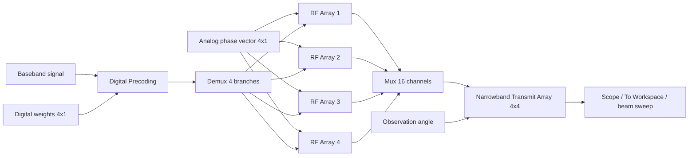
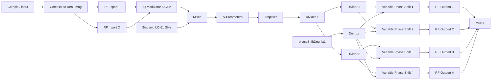

# Hybrid Beamforming 4×4 tại 66 GHz bằng MATLAB/Simulink

**Tên repository đề xuất:** `hybrid-beamforming-4x4-66ghz-matlab-simulink`

Dự án thiết kế và mô phỏng hệ thống **Hybrid Beamforming 4×4 tại 66 GHz** bằng MATLAB/Simulink R2021a. Hệ thống gồm 4 RF subarray, mỗi subarray điều khiển 4 phần tử anten patch, tổng cộng 16 phần tử.

Mục tiêu của repository:

- Thiết kế anten patch tại 66 GHz.
- Trích xuất mẫu bức xạ phần tử anten.
- Tạo mảng 4×4 từ 4 subarray 4×1.
- Tính trọng số beamforming digital và pha analog.
- Mô hình hóa chuỗi RF bằng RF Blockset Circuit Envelope.
- Ghép 16 tín hiệu vào `Narrowband Transmit Array`.
- Quan sát tín hiệu đầu ra và quét góc để dựng búp sóng.
- Tạo nền tảng để mở rộng sang QPSK, nhiễu, phi tuyến, phase noise và linh kiện RF thực.

---

## 1. Thông số chính

| Thông số | Giá trị |
|---|---:|
| Tần số trung tâm | `F0 = 66e9 Hz` |
| Bước sóng | `λ ≈ 4.5423 mm` |
| Khoảng cách phần tử | `d = λ/2 ≈ 2.2712 mm` |
| Số subarray | `4` |
| Số phần tử mỗi subarray | `4` |
| Tổng số phần tử | `16` |
| Góc lái mục tiêu | `Az = 20°`, `El = 15°` |
| MATLAB | R2021a |
| Tín hiệu thử baseline | Sine Wave 10 Hz |
| IF sau IQ Modulator | 5 GHz |
| LO của Mixer | 61 GHz |
| RF đầu ra mục tiêu | 66 GHz |

Bước sóng:

```math
\lambda = \frac{c}{f_0}
```

Với:

```math
c = 299\,792\,458\ \text{m/s},
\qquad
f_0 = 66\times10^9\ \text{Hz}
```

suy ra:

```math
\lambda \approx 4.5423\ \text{mm}
```

---

## 2. Phần mềm và toolbox

Dự án được xây dựng trên MATLAB R2021a với các toolbox chính:

- MATLAB
- Simulink
- Antenna Toolbox
- Phased Array System Toolbox
- RF Blockset
- RF Toolbox

Có thể bổ sung Communications Toolbox khi nâng cấp sang QPSK hoặc đánh giá link-level.

---

## 3. Cấu trúc repository

```text
hybrid-beamforming-4x4-66ghz-matlab-simulink/
│
├── 01_Antenna/
│   ├── HB4x4_patch_element.m
│   └── HB4x4_patch_data.mat
│
├── 02_Array/
│   ├── HB4x4_build_array.m
│   └── HB4x4_array_data.mat
│
├── 03_Beamforming/
│   ├── HB4x4_create_weights.m
│   └── HB4x4_weights_data.mat
│
├── 04_Simulink/
│   ├── HB4x4_top_level.slx
│   ├── HB4x4_load_data.m
│   └── HB4x4_sweep_pattern.m
│
├── 05_Results/
│   ├── antenna/
│   ├── array/
│   ├── scope/
│   └── beam_pattern/
│
├── docs/
│   └── figures/
│
├── references/
│   └── Hybrid-Beamforming-for-Massive-MIMO-Phased-Array-Systems.pdf
│
├── README.md
├── LICENSE
└── .gitignore
```

Các file `.mat` chứa dữ liệu đã tính trước để Simulink có thể nạp nhanh mà không cần chạy lại toàn bộ quá trình anten và mảng.

---

## 4. Kiến trúc tổng thể

Hybrid beamforming chia việc điều khiển chùm tia thành hai miền:

- **Digital beamforming:** điều khiển biên độ và pha của 4 tín hiệu cấp cho 4 subarray.
- **Analog beamforming:** dùng phase shifter để điều khiển pha của 4 phần tử trong mỗi subarray.



Hệ thống sử dụng 4 chuỗi RF số, mỗi chuỗi RF được chia thành 4 nhánh analog. Tổng số tín hiệu đưa vào mảng là:

```math
N_{\text{total}} = N_{\text{subarray}}\times N_{\text{element/subarray}}
=4\times4=16
```

---

## 5. Cơ sở toán học beamforming

### 5.1 Vector hướng

Với góc phương vị `az` và góc nâng `el`, vector đơn vị chỉ phương được viết:

```math
\mathbf{u}(az,el)=
\begin{bmatrix}
\cos(el)\cos(az)\\
\cos(el)\sin(az)\\
\sin(el)
\end{bmatrix}
```

Các góc trong biểu thức toán học được đổi sang radian khi tính toán.

Với phần tử thứ `n` nằm tại:

```math
\mathbf{p}_n=
\begin{bmatrix}
x_n\\y_n\\z_n
\end{bmatrix}
```

độ trễ truyền tương đối là:

```math
\tau_n=\frac{\mathbf{p}_n^T\mathbf{u}}{c}
```

Vector steering phía thu thường được mô tả:

```math
a_n(az,el)=e^{-j2\pi f_0\tau_n}
```

Đối với phát, trọng số bù pha thường dùng dạng liên hợp:

```math
w_n(az_0,el_0)=\frac{1}{\sqrt{N}}e^{+j2\pi f_0\tau_n}
```

Trong dự án, hàm `steervec` của MATLAB được sử dụng để quản lý quy ước dấu pha và hệ tọa độ.

### 5.2 Digital beamforming

Bốn subarray được điều khiển bởi vector trọng số digital:

```math
\mathbf{w}_{BB}=\begin{bmatrix}w_1&w_2&w_3&w_4\end{bmatrix}^{T}
```

Trọng số được tính theo vị trí tâm của 4 subarray và góc azimuth mục tiêu:

```matlab
wT_digital = steervec(subpos,[Az;0]);
```

Với cấu hình hiện tại, pha digital gần đúng:

```text
[-92.345
 -30.782
  30.782
  92.345] degree
```

Tín hiệu sau digital precoding:

```math
\mathbf{x}_{BB}(t)=\mathbf{w}_{BB}s(t)
```

Trong Simulink, phép toán này được thực hiện bằng khối `Product`:

```text
Sine Wave scalar × wT_digital 4×1
→ vector 4 phần tử
```

### 5.3 Analog beamforming

Mỗi subarray có 4 phần tử và mỗi nhánh được điều khiển bởi một phase shifter.

```math
\mathbf{w}_{RF}=\begin{bmatrix}e^{j\phi_1}&e^{j\phi_2}&e^{j\phi_3}&e^{j\phi_4}\end{bmatrix}^{T}
```

Do phase shifter lý tưởng chỉ điều chỉnh pha:

```math
|w_{RF,k}|=1
```

Trong MATLAB:

```matlab
wT_analog = exp(1i*angle(steervec(subelempos,[0;El])));
phaseShiftDeg = mod(angle(wT_analog)*180/pi,360);
```

Giá trị pha analog gần đúng:

```text
290.12 degree
336.71 degree
 23.29 degree
 69.88 degree
```

Vector `phaseShiftDeg` được cấp giống nhau vào cả 4 RF Array.

### 5.4 Trọng số hybrid

Trọng số cho toàn bộ 16 phần tử được tạo bằng tích Kronecker:

```math
\mathbf{w}_{HYB}=\mathbf{w}_{BB}\otimes\mathbf{w}_{RF}
```

Trong MATLAB:

```matlab
wT_hybrid = kron(wT_digital,wT_analog);
```

Với một tín hiệu dữ liệu `s(t)`, phần tử thứ `k` của subarray thứ `m` phát:

```math
x_{m,k}(t)=w_{BB,m}e^{j\phi_k}s(t)
```

### 5.5 Array factor và công suất theo góc

Đáp ứng toàn mảng tại góc quan sát `(az,el)`:

```math
y(az,el,t)=\mathbf{a}^{H}(az,el)\mathbf{w}_{HYB}s(t)
```

Khi dùng mẫu bức xạ phần tử `E_element`, trường tổng:

```math
E_{\text{total}}(az,el)=E_{\text{element}}(az,el)
\sum_{n=1}^{16}w_n e^{-jk\mathbf{p}_n^T\mathbf{u}(az,el)}
```

trong đó:

```math
k=\frac{2\pi}{\lambda}
```

Công suất trung bình tại một góc:

```math
P(az,el)=\operatorname{mean}\left(|y(az,el,t)|^2\right)
```

Chuẩn hóa về dB:

```math
P_{\text{norm,dB}}=10\log_{10}\left(\frac{P(az,el)}{\max P}\right)
```

Đỉnh mong muốn của phép quét azimuth phải nằm gần:

```text
Azimuth = 20 degree
Elevation = 15 degree
```

Nếu đỉnh bị đảo dấu hoặc lệch góc, cần kiểm tra quy ước trục, dấu của steering vector và cách ánh xạ vị trí phần tử.

---

## 6. Bước 1 — Thiết kế anten patch 66 GHz

### File

```text
01_Antenna/HB4x4_patch_element.m
```

### Mục tiêu

- Tạo anten `patchMicrostrip`.
- Thiết kế tại `F0 = 66e9`.
- Tính mẫu bức xạ full-wave.
- Lưu `P_isolated` để dùng trong Phased Array System Toolbox và Simulink.

### Quy trình cơ bản

```matlab
F0 = 66e9;
c = physconst('LightSpeed');
lambda = c/F0;

p = design(patchMicrostrip,F0);
P_isolated = pattern(p,F0);
```

Dữ liệu cần lưu:

```matlab
save('HB4x4_patch_data.mat', ...
    'p','F0','lambda','P_isolated');
```

### Kiểm tra

| Kiểm tra | Điều kiện đạt |
|---|---|
| Tần số thiết kế | `66 GHz` |
| Anten tạo thành công | Không lỗi `design` |
| Pattern | Không chứa toàn `NaN` hoặc toàn `0` |
| Kích thước dữ liệu | Phù hợp với vector `az`, `el` |

---

## 7. Bước 2 — Tạo custom antenna element

Mẫu bức xạ full-wave được ánh xạ sang `phased.CustomAntennaElement`:

```matlab
patchElement = phased.CustomAntennaElement;
patchElement.AzimuthAngles = az;
patchElement.ElevationAngles = el;
patchElement.MagnitudePattern = P_isolated;
patchElement.PhasePattern = zeros(size(P_isolated));
```

Dữ liệu hiện tại:

| Biến | Kích thước |
|---|---:|
| `az` | `1×73` |
| `el` | `1×37` |
| `P_isolated` | `37×73` |

Điều kiện bắt buộc:

```math
\operatorname{size}(P_{\text{isolated}})=[\operatorname{length}(el),\operatorname{length}(az)]
```

---

## 8. Bước 3 — Tạo subarray và mảng 4×4

### File

```text
02_Array/HB4x4_build_array.m
```

### Subarray 4×1

```matlab
sULA = phased.ULA( ...
    'NumElements',4, ...
    'Element',patchElement, ...
    'ElementSpacing',lambda/2, ...
    'ArrayAxis','z', ...
    'Taper',hamming(4));
```

### Ghép 4 subarray

```matlab
aURA = phased.ReplicatedSubarray( ...
    'Subarray',sULA, ...
    'GridSize',[1 4], ...
    'SubarraySteering','Phase', ...
    'PhaseShifterFrequency',F0, ...
    'GridSpacing',lambda/2);
```

### Lưu dữ liệu

```matlab
save('HB4x4_array_data.mat', ...
    'sULA','aURA','patchElement', ...
    'P_isolated','F0','lambda', ...
    'elementSpacing','az','el');
```

### Lưu ý taper

Chỉ nên áp taper tại một vị trí được kiểm soát rõ ràng.

- Phương án A: taper trong `sULA`, taper của URA bằng 1.
- Phương án B: không taper trong `sULA`, taper toàn mảng trong Simulink.

Áp Hamming ở cả hai nơi có thể tạo **double taper**, làm giảm directivity và thay đổi sidelobe không mong muốn.

---

## 9. Bước 4 — Tính trọng số beamforming

### File

```text
03_Beamforming/HB4x4_create_weights.m
```

### Cấu hình

```matlab
Az = 20;
El = 15;
```

### Mã tính trọng số

```matlab
subpos = getSubarrayPosition(aURA);
subelempos = getElementPosition(sULA);

wT_digital = steervec(subpos,[Az;0]);

wT_analog = exp(1i*angle( ...
    steervec(subelempos,[0;El])));

wT_hybrid = kron(wT_digital,wT_analog);

phaseShiftDeg = mod( ...
    angle(wT_analog)*180/pi,360);
```

Nếu phiên bản MATLAB không có các hàm trợ giúp `getSubarrayPosition` hoặc `getElementPosition`, lấy vị trí từ System object bằng hàm vị trí tương ứng của Phased Array System Toolbox và giữ đúng kích thước `3×N`.

### Lưu trọng số

```matlab
save('HB4x4_weights_data.mat', ...
    'Az','El', ...
    'wT_digital','wT_analog', ...
    'wT_hybrid','phaseShiftDeg');
```

### Kiểm tra

```matlab
assert(isequal(size(wT_digital),[4 1]));
assert(isequal(size(phaseShiftDeg),[4 1]));
assert(isequal(size(wT_hybrid),[16 1]));
```

---

## 10. Bước 5 — Nạp dữ liệu trước khi chạy Simulink

### File đề xuất

```text
04_Simulink/HB4x4_load_data.m
```

### Nội dung

```matlab
projectRoot = fileparts(fileparts(mfilename('fullpath')));

load(fullfile(projectRoot,'02_Array', ...
    'HB4x4_array_data.mat'), ...
    'P_isolated','F0','lambda', ...
    'elementSpacing','az','el');

load(fullfile(projectRoot,'03_Beamforming', ...
    'HB4x4_weights_data.mat'), ...
    'wT_digital','phaseShiftDeg');

fprintf('Loaded HB4x4 project data.\n');

whos F0 az el P_isolated ...
     lambda elementSpacing ...
     wT_digital phaseShiftDeg
```

### Kích thước bắt buộc

```text
F0                1×1
az                1×73
el                1×37
P_isolated        37×73
lambda            1×1
elementSpacing    1×1
wT_digital        4×1
phaseShiftDeg     4×1
```

Nếu Simulink báo:

```text
Unrecognized function or variable 'F0'
Unrecognized function or variable 'az'
```

thì nguyên nhân là chưa chạy `HB4x4_load_data.m`.

---

## 11. Bước 6 — Dựng mô hình Simulink top-level

### File

```text
04_Simulink/HB4x4_top_level.slx
```

### Các khối chính

| Khối | Số lượng | Vai trò |
|---|---:|---|
| `Sine Wave` | 1 | Tín hiệu baseband thử |
| `Constant [20;15]` | 2 | Góc lái và góc quan sát |
| `Beamformers` | 1 | Xuất digital weights và analog phases |
| `Product` | 1 | Digital precoding |
| `Demux` | 1 | Tách 4 tín hiệu digital |
| `RF Array` | 4 | 4 chuỗi RF/subarray |
| `Mux` | 1 | Ghép 16 tín hiệu |
| `Narrowband Tx Array` | 1 | Mô phỏng phát của mảng 4×4 |
| `Complex to Magnitude-Angle` | 1 | Lấy magnitude |
| `Scope` | 1 | Quan sát biên độ theo thời gian |
| `Display` | 1 | Đọc nhanh biên độ |
| `To Workspace` | 1 | Lưu tín hiệu để quét búp sóng |

---

## 12. Cấu hình nguồn top-level

### Sine Wave

Đường dẫn:

```text
Simulink → Sources → Sine Wave
```

Cấu hình baseline:

| Thông số | Giá trị |
|---|---:|
| Sine type | `Time based` |
| Time | `Use simulation time` |
| Amplitude | `1` |
| Bias | `0` |
| Frequency | `2*pi*10` rad/s |
| Phase | `0` |
| Sample time | `1e-3 s` |

Đây là tín hiệu baseband 10 Hz để dễ quan sát, không phải carrier 66 GHz.

### Constant góc

```text
Constant value = [20;15]
Interpret vector parameters as 1-D = on
```

- Constant thứ nhất nối vào `Beamformers/Angle`.
- Constant thứ hai nối vào `Narrowband Tx Array/Ang`.

Trong baseline hiện tại, trọng số được lấy từ Workspace nên đầu vào `Beamformers/Angle` chưa tính lại trọng số động.

---

## 13. Beamformers subsystem

Bên trong `Beamformers`:

| Khối | Giá trị |
|---|---|
| `Analog Phase` Constant | `phaseShiftDeg` |
| `Digital Weights` Constant | `wT_digital` |
| `Angle` | Tạm nối `Terminator` |
| Output 1 | `Phase Shift Array` |
| Output 2 | `Weights SubArray` |

Hai Constant phải bật:

```text
Interpret vector parameters as 1-D
```

Lỗi thường gặp:

```text
Digital Weights Constant value = 1
```

Khi đó `Digital Precoding` chỉ xuất scalar và `Demux` báo lỗi kích thước.

Giá trị đúng:

```text
Digital Weights = wT_digital
Analog Phase = phaseShiftDeg
```

---

## 14. Digital Precoding

Khối `Product` nhận:

```text
Input 1: Sine Wave scalar
Input 2: wT_digital vector 4×1
```

Đầu ra:

```math
\mathbf{x}_{BB}(t)=s(t)\mathbf{w}_{BB}
```

Kích thước mong muốn:

```text
Sine Wave → Product: 1
Weights → Product: 4
Product → Demux: 4
Mỗi đầu ra Demux: 1
```

Demux top-level:

```text
Number of outputs = [1 1 1 1]
```

---

## 15. Cấu trúc một RF Array

Mỗi RF Array đại diện cho một subarray gồm 4 phần tử.



### Số lượng khối trong mỗi RF Array

| Khối | Số lượng |
|---|---:|
| Simulink Inport | 2 |
| `Complex to Real-Imag` | 1 |
| RF Blockset `Inport` | 2 |
| `IQ Modulator` | 1 |
| `Mixer` | 1 |
| `Sinusoid` | 1 |
| `S-Parameters` | 1 |
| `Amplifier` | 1 |
| `Divider` | 3 |
| `Variable Phase Shift` | 4 |
| RF Blockset `Outport` | 4 |
| `Configuration` | 1 |
| Simulink `Demux` | 1 |
| Simulink `Mux` | 1 |
| Simulink `Outport` | 1 |

---

## 16. Cấu hình RF Blockset Configuration

| Thông số | Baseline |
|---|---:|
| Automatically select tones | On |
| Step size | `1e-3 s` |
| Simulate noise | Off |
| Temperature | `290 K` |
| Samples per frame | `1` |
| Normalize carrier power | On |
| Input interpolation filter | On |

`1e-3 s` là bước thời gian của **envelope 10 Hz**, không phải bước mô phỏng chu kỳ carrier 66 GHz.

Khi chuyển sang tín hiệu băng rộng hoặc QPSK tốc độ cao, phải giảm step size theo băng thông envelope.

---

## 17. RF Inport I/Q

Mỗi RF Array có 2 khối:

```text
RF Blockset → Circuit Envelope → Utilities → Inport
```

Cấu hình:

| Thông số | Giá trị |
|---|---|
| Source type | `Ideal voltage` |
| Carrier frequencies | `0 Hz` |
| Ground and hide negative terminal | On |

Nhánh `Re` nối vào I, nhánh `Im` nối vào Q.

Với Sine Wave thực:

```text
I = sin(2π10t)
Q = 0
```

---

## 18. IQ Modulator

### Main

| Thông số | Giá trị |
|---|---:|
| Conversion gain source | `Available power gain` |
| Available power gain | `0 dB` |
| Local oscillator frequency | `5e9 Hz` |
| Input impedance | `50 Ω` |
| Output impedance | `50 Ω` |
| Image reject filter | Off |
| Channel select filter | Off |

### Impairments

| Thông số | Baseline |
|---|---:|
| I/Q gain mismatch | `0 dB` |
| I/Q phase mismatch | `0°` |
| LO to RF isolation | `inf dB` |
| Noise floor | `-inf dBm/Hz` |
| Phase noise | Off |

### Nonlinearity

| Thông số | Baseline |
|---|---:|
| IP2 | `inf dBm` |
| IP3 | `inf dBm` |

---

## 19. Mixer và kế hoạch tần số

Mixer nhận:

```text
IF = 5 GHz
LO = 61 GHz
```

Sinh ra:

```math
f_{\text{sum}} = 61+5=66\ \text{GHz}
```

và:

```math
f_{\text{difference}} = 61-5=56\ \text{GHz}
```

### Cấu hình Mixer

| Thông số | Giá trị |
|---|---:|
| Available power gain | `0 dB` |
| Input impedance | `50 Ω` |
| Output impedance | `50 Ω` |
| LO impedance | `inf Ω` |
| Noise figure | `0 dB` |
| IP2 | `inf dBm` |
| IP3 | `inf dBm` |

---

## 20. Nguồn LO Sinusoid — cấu hình bắt buộc

Đây là lỗi quan trọng đã từng làm toàn bộ đầu ra bằng 0.

Đường dẫn:

```text
RF Blockset → Circuit Envelope → Sources → Sinusoid
```

Cấu hình:

| Thông số | Giá trị |
|---|---:|
| Source type | `Ideal voltage` |
| Offset in-phase | `1 V` |
| Offset quadrature | `0 V` |
| Sinusoidal amplitude in-phase | `0 V` |
| Sinusoidal amplitude quadrature | `0 V` |
| Sinusoidal modulation frequency | `0 Hz` |
| Time delay | `0 s` |
| Carrier frequencies | `61e9 Hz` |
| Ground and hide negative terminal | On |

Nếu tất cả offset và amplitude bằng 0:

```math
v_{LO}(t)=0
```

khi đó Mixer không chuyển tần và Scope bằng 0.

Phải cấu hình giống nhau cho cả 4 RF Array.

---

## 21. S-Parameters

Baseline sử dụng:

```text
Data file = unitygain.s2p
```

Cấu hình:

| Thông số | Giá trị |
|---|---|
| Data source | `Data file` |
| Modeling | `Time domain (rationalfit)` |
| Fitting | `Share all poles` |
| Relative error desired | `-40 dB` |
| Simulate noise | Off |

`unitygain.s2p` chỉ là mạng truyền thẳng baseline, không phải bộ lọc thật.

Để kiểm tra truyền thuận:

```text
Visualization → Parameter1 = S(2,1)
Format = Magnitude (decibels)
```

Đổi `S(1,1)` sang `S(2,1)` trong tab Visualization chỉ đổi đồ thị xem, không thay đổi mô phỏng.

Phiên bản hoàn thiện cần một filter model có:

- `S21` suy hao mạnh tại 56 GHz.
- `S21` cho qua tại 66 GHz.

---

## 22. Amplifier

Baseline:

| Thông số | Giá trị |
|---|---:|
| Available power gain | `0 dB` |
| Input impedance | `50 Ω` |
| Output impedance | `50 Ω` |
| Noise figure | `0 dB` |
| IP2 | `inf dBm` |
| IP3 | `inf dBm` |

Sau khi baseline ổn định có thể thử gain 10 dB hoặc 20 dB và thêm compression/nonlinearity theo datasheet.

---

## 23. Divider tree

Mỗi RF Array cần 3 `Divider` để tạo 4 nhánh:

```text
Amplifier
   ↓
Divider 1
 ├─ Divider 2 → nhánh 1, 2
 └─ Divider 3 → nhánh 3, 4
```

Chọn:

```text
Resistive power divider
Reference impedance = 50 Ω
```

Bộ chia lý tưởng làm giảm công suất mỗi nhánh; cần phân biệt suy hao chia công suất với insertion loss của linh kiện thực.

---

## 24. Variable Phase Shift

Mỗi RF Array có 4 khối `Variable Phase Shift`.

Tín hiệu điều khiển:

```text
phaseShiftDeg 4×1
→ Demux [1 1 1 1]
→ 4 Variable Phase Shift
```

Đơn vị:

```text
deg
```

Mỗi phase shifter nhận một nhánh RF từ divider và xuất sang RF Outport tương ứng.

---

## 25. RF Outport

Mỗi RF Array có 4 `Outport`, tổng cộng 16.

Cấu hình:

| Thông số | Giá trị |
|---|---|
| Sensor type | `Ideal voltage` |
| Output | `Complex Baseband` |
| Carrier frequencies | `F0` |
| Ground and hide negative terminal | On |

`F0` phải tồn tại trong Base Workspace:

```matlab
F0 = 66e9;
```

Nếu Outport để carrier `0 Hz`, tín hiệu 66 GHz có thể không được trích xuất về miền Simulink.

---

## 26. Narrowband Transmit Array

### Main

| Thông số | Giá trị |
|---|---|
| Propagation speed | `physconst('LightSpeed')` |
| Operating frequency | `F0` |
| Sensor gain measure | `dB` |
| Weights input | Off |
| Execution | Interpreted |

### Sensor Array

| Thông số | Giá trị |
|---|---|
| Array type | `Array (no subarrays)` |
| Element | Custom Antenna |
| Frequency vector | `[0 1e20]` |
| Frequency response | `[0 0]` |
| Azimuth angles | `az` |
| Elevation angles | `el` |
| Magnitude pattern | `P_isolated` |
| Phase pattern | `zeros(size(P_isolated))` |
| URA size | `[4 4]` |
| Element spacing | `[elementSpacing elementSpacing]` |
| Lattice | Rectangular |
| Array normal | x-axis |

Đầu vào `X` phải là vector 16 phần tử.

Đầu vào `Ang`:

```text
[Azimuth; Elevation]
```

đơn vị độ.

---

## 27. Thiết bị đo

### Scope

Nối sau:

```text
Narrowband Tx Array
→ Complex to Magnitude-Angle
→ Scope
```

Nếu chọn `Output = Magnitude`, dạng sóng giống chỉnh lưu toàn kỳ:

```math
|\sin(\omega t)|
```

Đây không phải lỗi mạch; magnitude luôn không âm.

### Display

Nối song song sau Magnitude để đọc giá trị tức thời.

### To Workspace

Nối trực tiếp đầu ra phức của `Narrowband Tx Array`.

Cấu hình:

```text
Variable name = beamOut
Save format = Timeseries
```

Dữ liệu này dùng để tính công suất và quét búp sóng.

---

## 28. Chạy baseline

### Bước 1

Mở MATLAB tại thư mục:

```text
04_Simulink
```

### Bước 2

Chạy:

```matlab
HB4x4_load_data
```

### Bước 3

Mở mô hình:

```matlab
open_system('HB4x4_top_level')
```

### Bước 4

Đặt:

```text
Stop Time = 0.1 hoặc 0.2 s
```

### Bước 5

Nhấn:

```text
Ctrl + D
```

để Update Diagram.

### Bước 6

Nhấn Run và Autoscale Scope.

### Kết quả mong muốn

| Vị trí đo | Kết quả |
|---|---|
| Sau Sine Wave | Sin 10 Hz, từ -1 đến +1 |
| Sau Magnitude | Dạng `|sin|` |
| RF Array output | Khác 0 |
| Narrowband Tx Array output | Khác 0 |
| Diagnostic Viewer | Không có lỗi đỏ |

---

## 29. Script quét azimuth và vẽ búp sóng

### File đề xuất

```text
04_Simulink/HB4x4_sweep_pattern.m
```

### Yêu cầu mô hình

- Constant góc quan sát phải có tên block `Angle`.
- `To Workspace` phải xuất biến `beamOut`.
- Trọng số giữ cố định ở `Az = 20°`, `El = 15°`.

### Script

```matlab
%% HB4x4_sweep_pattern.m
clearvars -except F0 az el P_isolated ...
    lambda elementSpacing ...
    wT_digital phaseShiftDeg
clc

mdl = 'HB4x4_top_level';
angleBlock = [mdl '/Angle'];

azSweep = -90:5:90;
fixedEl = 15;

powerLinear = zeros(size(azSweep));

load_system(mdl);

for k = 1:numel(azSweep)
    angleValue = sprintf('[%g;%g]', ...
        azSweep(k),fixedEl);

    set_param(angleBlock,'Value',angleValue);

    sim(mdl,'StopTime','0.2');

    beamTs = evalin('base','beamOut');

    if isa(beamTs,'timeseries')
        y = beamTs.Data;
    else
        y = beamTs;
    end

    y = y(:);
    valid = isfinite(y);
    y = y(valid);

    if isempty(y)
        error('beamOut does not contain valid samples.');
    end

    powerLinear(k) = mean(abs(y).^2);
end

powerDb = 10*log10(powerLinear/max(powerLinear));

[peakDb,idxPeak] = max(powerDb);
peakAz = azSweep(idxPeak);

figure;
plot(azSweep,powerDb,'LineWidth',1.5);
grid on;
xlabel('Azimuth (degree)');
ylabel('Normalized power (dB)');
title(sprintf('HB4x4 beam pattern, El = %.1f degree',fixedEl));
ylim([-40 0]);

hold on;
plot(peakAz,peakDb,'o');
text(peakAz,peakDb,sprintf('  Peak %.1f degree',peakAz));

fprintf('Peak azimuth = %.2f degree\n',peakAz);

results.azSweep = azSweep;
results.fixedEl = fixedEl;
results.powerLinear = powerLinear;
results.powerDb = powerDb;
results.peakAz = peakAz;

projectRoot = fileparts(fileparts(mfilename('fullpath')));
resultFolder = fullfile(projectRoot,'05_Results','beam_pattern');

if ~exist(resultFolder,'dir')
    mkdir(resultFolder);
end

save(fullfile(resultFolder,'HB4x4_azimuth_sweep.mat'),'results');
saveas(gcf,fullfile(resultFolder,'HB4x4_azimuth_pattern.png'));
```

### Quét nhanh và quét tinh

Để giảm thời gian chạy Circuit Envelope:

1. Quét nhanh:

```matlab
azSweep = -90:5:90;
```

2. Sau khi xác định vùng đỉnh, quét tinh:

```matlab
azSweep = 10:1:30;
```

Kết quả mục tiêu:

```text
Peak azimuth ≈ 20 degree
```

Nếu không đúng, xem mục xử lý lỗi bên dưới.

---

## 30. Xử lý lỗi thường gặp

### Thiếu biến Workspace

Thông báo:

```text
Unrecognized function or variable 'F0'
Unrecognized function or variable 'az'
```

Cách sửa:

```matlab
HB4x4_load_data
```

### Demux nhận scalar thay vì vector 4

Kiểm tra:

```text
Digital Weights = wT_digital
Analog Phase = phaseShiftDeg
Demux = [1 1 1 1]
```

### Scope bằng 0

Kiểm tra theo thứ tự:

1. Scope trực tiếp sau `Sine Wave`.
2. Đầu ra `Digital Precoding`.
3. Nguồn LO Sinusoid:
   - Offset I = 1 V.
   - Carrier = 61e9 Hz.
4. RF Outport:
   - Complex Baseband.
   - Carrier = F0.
5. Đầu ra riêng `RF Array 1`.
6. Tạm bypass `S-Parameters`.

Nguyên nhân đã từng gặp trong dự án:

```text
LO Sinusoid chưa cấu hình
→ LO = 0
→ Mixer output = 0
→ Scope = 0
```

### Scope giống chỉnh lưu toàn kỳ

Nguyên nhân:

```text
Complex to Magnitude-Angle
Output = Magnitude
```

Do:

```math
|y|=\sqrt{\Re(y)^2+\Im(y)^2}\ge0
```

Muốn xem phần âm/dương, dùng:

```text
Complex to Real-Imag → Re → Scope
```

### Búp sóng sai hướng

Kiểm tra:

- Thứ tự phần tử trong vector 16.
- Cách `Mux` ghép 4 RF Array.
- Trục `x/y/z` của URA.
- Dấu của phase shift.
- `steervec` dùng cho phát hay thu.
- Góc khai báo theo `[Az;El]`.
- `P_isolated` có bị xoay hoặc transpose.
- Có double taper hay không.

Thử kiểm tra dấu pha:

```matlab
phaseShiftDegTest = mod(-angle(wT_analog)*180/pi,360);
```

Chỉ thay đổi sau khi lưu bản mô hình baseline.

### Sensor Array Analyzer lỗi Java Toolstrip

Lỗi giao diện này không làm sai mô hình Simulink.

Thử:

1. Đóng ứng dụng.
2. `Home → Layout → Default`.
3. Khởi động lại MATLAB.
4. Dùng script quét `To Workspace` thay cho ứng dụng nếu lỗi lặp lại.

---

## 31. Kết quả hiện tại

Trạng thái đã đạt:

- Anten patch 66 GHz đã được tạo.
- Mảng 4×4 đã được dựng.
- Digital weights 4×1 đã được tạo.
- Analog phase vector 4×1 đã được tạo.
- 4 RF Array đã được dựng.
- Nguồn LO 61 GHz đã được sửa.
- Scope đã có tín hiệu.
- Dạng magnitude `|sin|` đã được xác nhận.
- Mô hình baseline chạy được.

Công việc tiếp theo:

- Quét azimuth và xác nhận đỉnh gần 20°.
- Kiểm tra elevation pattern.
- Sửa orientation của `P_isolated` nếu cần.
- Tránh double taper.
- Thay `unitygain.s2p` bằng filter thật.
- Thêm gain, noise figure, phase noise và phi tuyến.
- Thay Sine Wave bằng QPSK.
- Đánh giá EVM, constellation và BER.

---

## 32. Giới hạn của baseline

Phiên bản hiện tại chưa phải mô hình phần cứng hoàn chỉnh:

- S-Parameters đang dùng `unitygain.s2p`.
- Amplifier và Mixer đang lý tưởng.
- Chưa mô hình phase noise.
- Chưa có gain/phase mismatch.
- Chưa có mutual coupling đầy đủ giữa 16 phần tử.
- Chưa có kênh truyền và máy thu.
- Cổng `Beamforming` chưa cập nhật trọng số động.
- Tín hiệu đầu vào là Sine Wave thấp tần để kiểm tra.
- Búp sóng cuối cùng vẫn cần kiểm tra quy ước trục và taper.

---

## 33. Lộ trình nâng cấp

### Giai đoạn 1 — hoàn thiện búp sóng

- Quét azimuth.
- Quét elevation.
- Xác định peak direction.
- Tính HPBW.
- Tính sidelobe level.
- Kiểm tra directivity.

### Giai đoạn 2 — RF thực tế

- Filter 56/66 GHz.
- PA gain và P1dB.
- Mixer conversion loss.
- Noise figure.
- Phase noise.
- I/Q imbalance.
- Insertion loss của divider và phase shifter.

### Giai đoạn 3 — truyền thông số

- Random Integer Generator.
- QPSK Modulator Baseband.
- AWGN hoặc kênh mmWave.
- Receiver beamforming.
- Constellation Diagram.
- EVM.
- BER.

### Giai đoạn 4 — điều khiển động

- Tính lại `wT_digital` theo cổng Beamforming.
- Tính lại `phaseShiftDeg` theo góc đầu vào.
- Multi-user/multi-beam.
- Beam tracking.
- Failed-element analysis.

---

## 34. Quy trình GitHub đề xuất

### Tạo repository

Tên:

```text
hybrid-beamforming-4x4-66ghz-matlab-simulink
```

Mô tả:

```text
4x4 hybrid beamforming transmitter at 66 GHz using MATLAB,
Simulink, Phased Array System Toolbox and RF Blockset.
```

### Khởi tạo Git

```bash
git init
git add .
git commit -m "Initial 66 GHz hybrid beamforming 4x4 model"
git branch -M main
git remote add origin <YOUR_REPOSITORY_URL>
git push -u origin main
```

### `.gitignore` đề xuất

```gitignore
# MATLAB autosave and temporary files
*.asv
*.m~
*.autosave

# Simulink generated files
slprj/
*_grt_rtw/
*_ert_rtw/
*.slxc

# MATLAB project cache
DerivedData/

# OS
Thumbs.db
.DS_Store

# Large generated results
05_Results/**/*.fig
05_Results/**/*.mat
```

Không bỏ qua các file `.mat` nhỏ cần thiết để chạy mô hình. Nếu file dữ liệu lớn, dùng Git LFS.

---

## 35. Tài liệu tham khảo chính

1. **Hybrid Beamforming for Massive MIMO Phased Array Systems**, TechSource/MathWorks white paper.
2. MATLAB documentation for:
   - `patchMicrostrip`
   - `phased.CustomAntennaElement`
   - `phased.ULA`
   - `phased.ReplicatedSubarray`
   - `steervec`
   - `Narrowband Transmit Array`
3. RF Blockset documentation for:
   - Circuit Envelope `Configuration`
   - `Inport` and `Outport`
   - `IQ Modulator`
   - `Mixer`
   - `Sinusoid`
   - `Amplifier`
   - `Divider`
   - `Variable Phase Shift`
   - `S-Parameters`

---

## 36. Ghi chú kỹ thuật

Các giá trị 5 GHz IF, 61 GHz LO, gain 0 dB, step size `1e-3 s` và file `unitygain.s2p` là cấu hình baseline của repository. Chúng được chọn để kiểm tra luồng tín hiệu và kiến trúc hybrid beamforming trước khi thay bằng thông số linh kiện thực.

Không dùng kết quả baseline để kết luận hiệu suất phần cứng cuối cùng nếu chưa bổ sung:

- dữ liệu linh kiện thực;
- mutual coupling;
- filter response;
- PA nonlinearity;
- noise;
- channel model;
- calibration errors.

---

## 37. License

Khuyến nghị dùng MIT License cho repository học thuật và mô phỏng mở. Kiểm tra quyền phân phối đối với mọi PDF, ảnh và dữ liệu của bên thứ ba trước khi đẩy lên GitHub.
